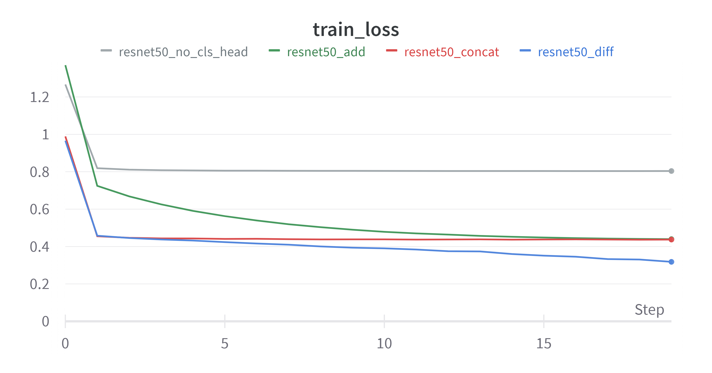
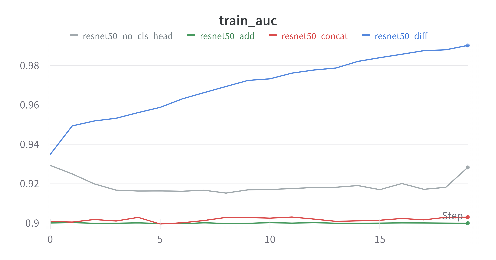
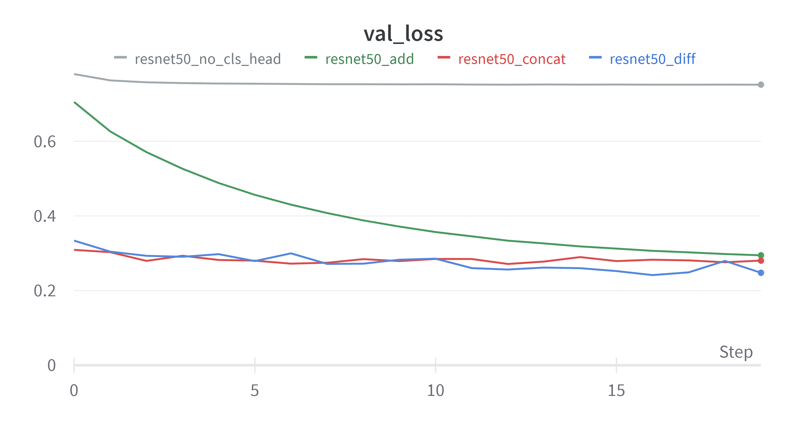
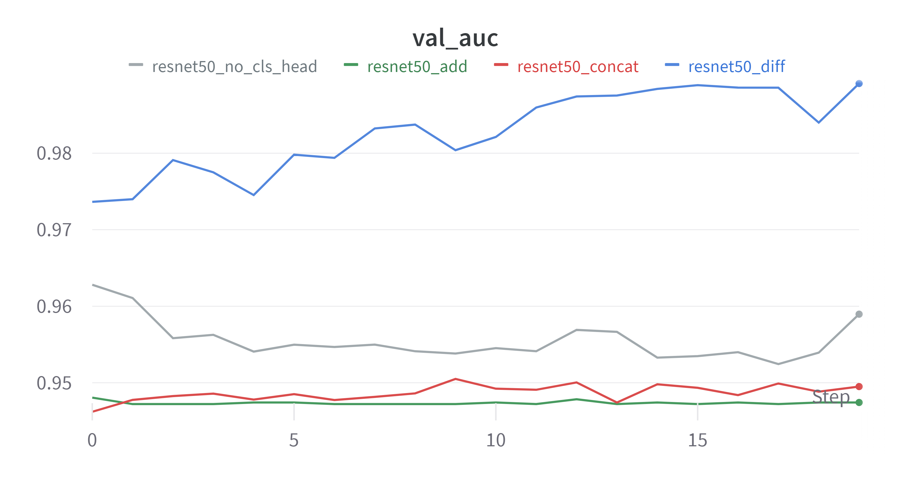

# Face Recognition

This project is part of the assessmnet of the course . It is inspired from the feature of Google Photos where photos of photos of people with similar face are grouped together.
 

## Network Details

### Architecture and Backbone
Genrally in this scenario, the go-to approch is Siamese Architecture with triplet loss is used where the distance is less then certain threshold, the faces are simaliar, else disimilar. 

In this project, though Siamese Architecture is used, instead of triplet loss and distance-threshold approach, a binary classification approach was adopted. And the backbone for Siamese Architecture is Resnet 50 upto layer2.

Since the architecture is siamese, there will two images. Hence, two embeddings. Therefore, choosing right aggregation method is crucial as this aggregated embeddings in passed through `classifier head` to get the result. These are the following methods that are tested in this project.

1. Aggregation by Addition

2. Aggregation by Concatnation

3. Aggregation by Difference

Apart from these, Euclidian distance can be directly calculated and can be passed through sigmiod to get binary output. This does not require any `classifier head`.  

### Dataset and Dataloader
Labelled Faces in Wild dataset with images being croped to face using Haar-cascade method is used as dataset. 

Instead directly using the pairs that were given in dataset,the training set for each epoch is sampled randomly from train data where as validation set which is sampled from validation data remains fixed for entire training process as is saved for further use case. 

### Loss Function 
`Binary Cross Entropy Loss` and `Hinge Loss` were used

## Results

As you can see, though `no classifier head` method performs better than both `add` and `concat` aggregation methods, `difference` aggregation method outperforms all 3 by huge margin.

